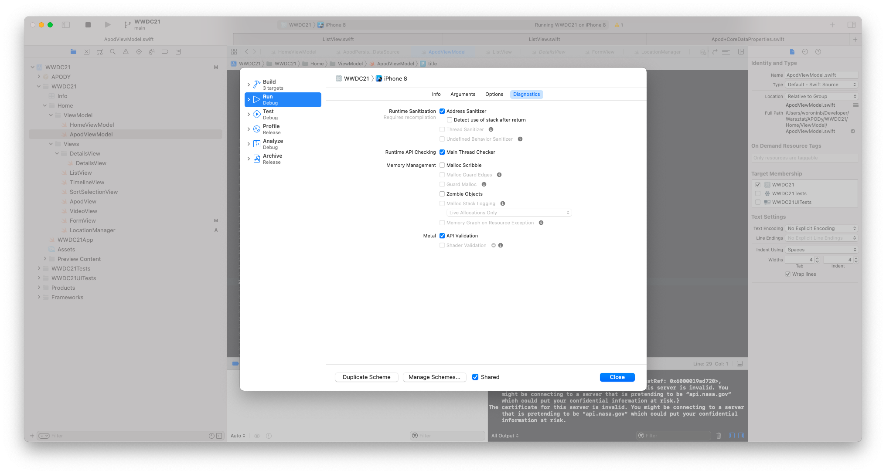
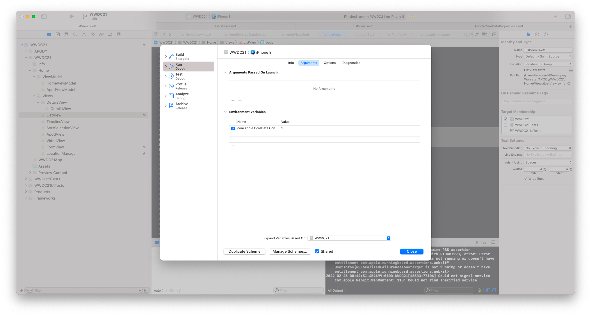

## NEW API for ManagedObjectContext

Example with the old approach:

```
var performError: Error?

backgroundContext.performAndWait {
	let batchInsertRequest = self.makeBatchInsertRequest(with: converted)
	guard let fetchResult = try? backgroundContext.execute(batchInsertRequest), let batchInsertResult = fetchResult as? NSBatchInsertResult, let success = batchInsertResult.result as? Bool, sucess else {
		performError = QuakeError.batchInsertError
	}
}

if let error = performError {
	throw error
}

```

to compare it we can look at the usage with the new API:

```
try await backgroundContext.perform {
	let batchInsertRequest = self.makeBatchInsertRequest(with: converted)
	guard let fetchResult = try? backgroundContext.execute(batchInsertRequest), let batchInsertResult = fetchResult as? NSBatchInsertResult, let success = batchInsertResult.result as? Bool, sucess else {
		throw QuakeError.batchInsertError
	}
}

```

### Summary 

- provided closure now allows you to throw an error or return a value
- much more elegant way of handling the errors

Let's look at another example:

```
var quakeCount: NSNumber?
moc.performAndWait {
	let calendar = Calendar.cuurent
	let fiveDaysAgo = calendar.date(byAdding: .hour, value: -5, to: Date())
	let request = Quake.fetchRequest()
	request.resultType = NSCountResultType
	request.predicate = NSPredicate(format: "date > %@", fiveDaysAgo)
	quakeCount = request.execute().last!
}

```

and let's compare it to the new API:

```
let quakeCount = try await moc.perform {
	let calendar = Calendar.cuurent
	let fiveDaysAgo = calendar.date(byAdding: .hour, value: -5, to: Date())
	let request = Quake.fetchRequest()
	request.resultType = NSCountResultType
	request.predicate = NSPredicate(format: "date > %@", fiveDaysAgo)
	request.execute().last!
}
```

so now we can just return the value and await the value of our perform call instead of creating a property for the result for later usage like in the old approach.

### Problematic situations

```
let moc = NSManagedObjectContext(.privateQueue)

let mostRecentEarthQuake = try await moc.perform {
let request = Quake.fetchRequest()
request.sortDescriptors = [NSSortDescriptor(key: "date", ascending: false)]
request.fetchLimit = 1
request.resultType = NSManaedObjectResultType
request.execute().first!
}

// It would be unsafe to interact with mostRecentEarthQuake here
```

While the new API makes it really easy to return values, it is not safe to return managed objects that are already registered to a managed object context. 

Instead, if you need to refer to a managed object between different execution contexts, either make use of the object ID and refetch as needed, or make use of the dictionary representation option of the fetch request.


```
let moc = NSManagedObjectContext(.privateQueue)

let mostRecentEarthQuake = try await moc.perform {
let request = Quake.fetchRequest()
request.sortDescriptors = [NSSortDescriptor(key: "date", ascending: false)]
request.fetchLimit = 1
request.resultType = NSManaedObjectIDResultType // or NSDictionaryResultType
request.execute().first!
}

```

### ScheduleTaskType

We have two possible values:

- immediate (default option)
- enqueued

### immediate

immediate behaves a lot like a Swift-async-aware version of **performAndWait**.
If you're running on a different execution context and ask to await work performed on the background context, you will wait until it is scheduled and completed.

If you're already on the same execution context, however, the work will be optimistically scheduled right away.

### enqueued

It simply always just appends the requested work to the end of the contexts' work set, regardless of the affinity of the originating call site.

| When I used to call | I can instead now call   |
|---------------------|--------------------------|
| .performAndWait     | await perform            |
| .perform            | await perform(.enqueued) |


## Debugging concurrency in CoreData

- Address sanitizer
- Thread sanitizer
- Core Data concurrency debug

Sanitizers detects different kinds of issues, including validating safe memory use assumptions and appropriate use of data from multiple threads.



And while the sanitizers are useful in all contexts, I also wanna highlight that Core Data provides a special runtime flag that you can enable to get more domain-specific help. By enabling this option, Core Data will turn on a number of useful assertions to validate internal locks and confirm appropriate use of various Core Data types.



### Shorter names for NSPersistanceStors
 
The existing names will continue to work, but the new API that consumes these will be a lot more ergonomic to use due to the shorter names and ability to autocomplete these symbols

- .xml
- .binary
- .inMemory
- .sqlite

### NSAttributeDescription.AttributeType 

more natural syntax for working with attribute types: 

/.uri
/.objectId
/.float
/.double
/.integer16

### Unit test to validate our runtime schema matches expectation

```
func testQuakeEntity() {
	let quakeEntity = persistentContainer.managedObjectModel.entitiesByName["Quake"]!
verifyAttribute(named: "location", on: quakeEntity, hasType: .string)
}
```

## Core Data and SwiftUI

### Lazy entity resolution in fetch requests

```
var body: some Scene {
	WindowGroup {
		ContentView()
			.environment(\.managedObjectContext, QuakesProvider.shared.container.viewContext)
	}
}
```

The FetchRequest property wrapper now looks up entities by name lazily at fetch-time, at which point the environment has guaranteed that the Core Data stack has been set up, 

### SecionedFetchRequest

- is a support for sectioned fetching
- It gets initialized with an additional parameter, a key path to a property that identifies the section (hashable)
- SwiftUI gives me automatic support for collapsing sections.

```
    @SectionedFetchRequest(
        sectionIdentifier: \Apod.month,
        sortDescriptors: [SortDescriptor(\Apod.date, order: .reverse)]
    )
    public var apods: SectionedFetchResults<String, Apod>
    
    
    List {
        ForEach(apods) { section in
             Section(header: Text(section.id)) {
                  ForEach(section) { apod in
                         ApodView(...
```

Below presented a implemented sections on UI 


