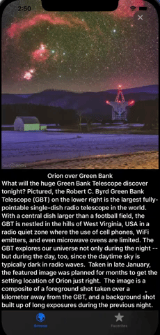

### Timelineview

`Timelineview` allows to redraw the content it contains at scheduled points in time.

```
TimelineView(.animation) { timeline in
     ZStack {
        Color.black
        let now = timeline.date.timeIntervalSinceReferenceDate
        let angle = Angle.degrees(now.remainder(dividingBy: 360))
        makeStarLayer(time: now, angle: angle, proxy: proxy, color: Color(uiColor: .lightGray))
     }
}
```

In our case we wanted to create some kind of background which will rotate imitating the stars field. The end result is not satisfying enough but it shows the possibility of the `Timelineview`.

Below we present the function that prepares the `Canvas` view which draws stars with the fixed position on screen, and then rotate the whole context by the specific angle depending on the time received from the `Timelineview`.

```
@ViewBuilder
    func makeStarLayer(time _: TimeInterval, angle: Angle, proxy: GeometryProxy, color: Color) -> some View {
        Canvas { context, _ in
            for (index, star) in stars.enumerated() {
                guard let coordinate = grid[index] else {
                    return
                }
                let xCoordinate = proxy.size.width * coordinate.0
                let yCoordinate = proxy.size.height * coordinate.1
                let image = context.resolve(
                    Text(star)
                        .font(.system(size: 10))
                        .foregroundColor(color)
                )
                context.rotate(by: angle)
                context.draw(image, at: .init(x: xCoordinate, y: yCoordinate))
            }
        }
    }
```

And a result in the app:

